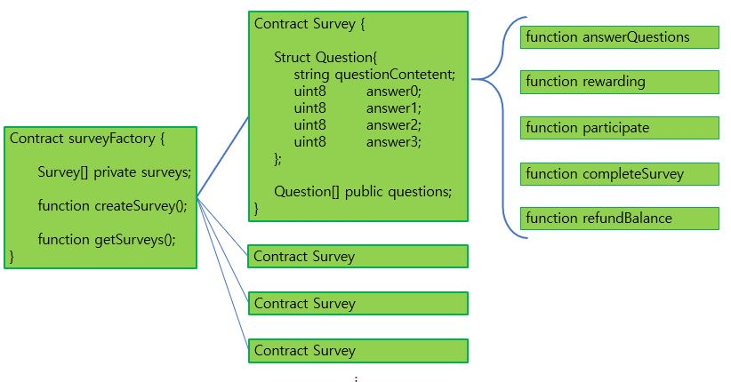

# Blockvey #

- 본 프로젝트는 **Startup Weekends Seoul: Blockchain Hackathon(2018.11.30-2011.12.02)**에 참여하여 진행한 프로젝트입니다.
- 블록체인 기반의 설문조사 플랫폼을 만들고자 했습니다.
- 리워딩 시스템을 통해 설문조사의 자발적인 참여를 유도하고, 블록체인을 통해 신뢰가 확보된 통계자료를 수집하는 것이 목적입니다.
- 현재 이더리움 기반의 스마트 컨트랙트만 구현된 상태이며, 추후 수정이 필요합니다.

## 컨트랙트 구조 ##

## 프로토타입 ##
https://xd.adobe.com/view/2d5241e3-43e2-452e-49bd-0a2f93435c02-5b63/